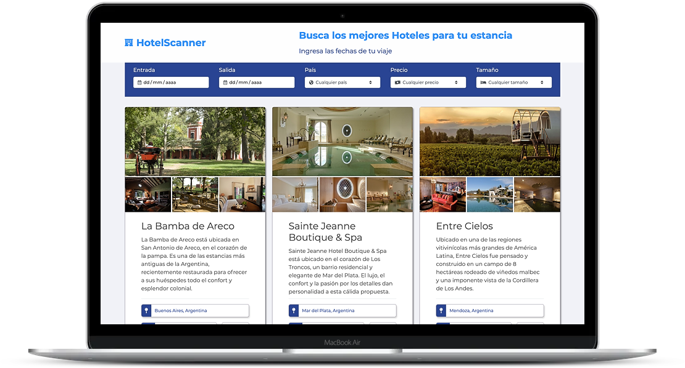

# HotelScanner

### An application to search and filter your favorite hotels

---

[Spanish Version](./README.md)

This was the first project from the Advanced Frontend (React Focused) course given by [Acamica](https://acamica.com).

The application consists of a search page to find your favorite hotels. Based on certain filters that the user can apply according to their interests, the application returns a certain list of hotels that meet the user's requirements.

All the libraries and other dependencies used in this project were imported through the use of CDN, since this was a delivery requirement for the project.

To run the application, you just need to open the `index` file with Live Server or similar. You don't need to run any `npm` or `yarn` command.

List of libraries and dependencies used in this project.

- React
- React DOM
- Babel
- Bootstrap
- SASS
- Moment Js
- Google Fonts
- FontAwesome
- Placeholder Loading (Skeleton Loader)
- AOS Js

## [Live Demo](https://alazzuri.github.io/hotelScanner/)
